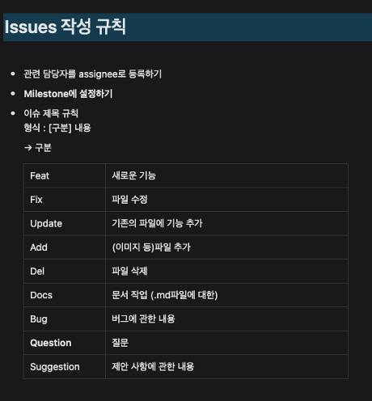
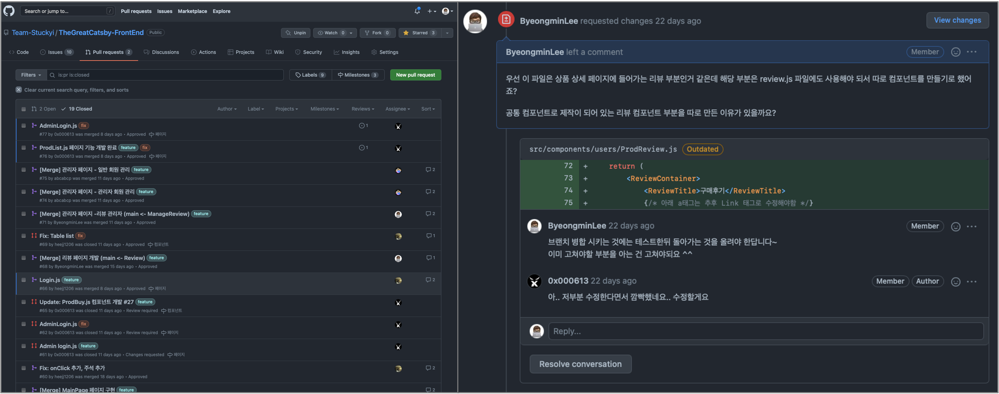

# Team Stuckyi

## 👋 소개

**Team Stuckyi** 소개 페이지 입니다. 
팀 프로젝트로 쇼핑몰 사이트를 프론트엔드 부터 백엔드까지 풀 스택으로 개발을 하였고, 개발을 진행하는 과정에서 커뮤니케이션과 효율적으로 개발을 하기 위한 방법을 고민하였습니다.  
그리고 서로 공부한 것을 공유하고자 스터디를 진행했습니다.

### 목차

1. [👥 멤버](#-멤버) 
2. [🚀 프로젝트](#-프로젝트) 
    - [The Great Catsby](#the-great-catsby) 
    - [Stuckyi TechCamp](#stuckyi-techcamp) 
3. [🤝 커뮤니케이션](#-커뮤니케이션) 
    - [1. Discord](#1-discord) 
    - [2. Notion](#2-notion) 
    - [3. Github](#3-github) 

 

## 👥 멤버

|                                   |                                |                                |                               |                                 |
| ------------------------------------------------------------------- | --------------------------------------------------------------- | ---------------------------------------------------------------- | -------------------------------------------------------------- | ----------------------------------------------------------------- |
| 
[이병민](https://github.com/ByeongminLee)
 | 
[김우영](https://github.com/0x000613)
 | 
[노희재](https://github.com/heejj1206)
 | 
[이슬기](https://github.com/abcabcp)
 | 
[전찬민](https://github.com/cksals3753)
 |

 

## 🚀 프로젝트

### The Great Catsby

<table>
    <tr>
        <td><a href="https://github.com/Team-Stuckyi/TheGreatCatsby-FrontEnd">Front-End</a></td>
        <td>
            
            
            
            
        </td>
    </tr>
    <tr>
        <td><a href="https://github.com/Team-Stuckyi/TheGreatCatsby-BackEnd">Back-End</a></td>
        <td>
            
            
        </td>
    </tr>
        <tr>
        <td><a href="https://github.com/Team-Stuckyi/TheGreatCatsby-Database">Database</a></td>
        <td>
            
        </td>
    </tr>
</table>

-   고양이 쇼핑몰 ‘고양이 대통령’ 사이트를 모티브로 제작한 쇼핑몰 사이트
-   Full-Stack 개발 (React + Node.js)
-   Figma로 프로토타입 화면 구현
-   StyledComponents & SCSS로 화면 개발
-   Redux ToolKit을 이용한 상태관리
-   Node.js로 백엔드 Restful API 구현
-   데이터베이스(mySQL) 설계 및 구현

> 프로젝트에 관한 상세 내용은 각 저장소에서 확인하 실 수 있습니다.

 

### Stuckyi TechCamp

6주간 서로 매주 공부한 지식을 공유한 프로젝트 입니다.  
동일한 시간 내에서 하나하나 찾아 가면서 공부를 하기에는 부족한 점이 많다고 느꼇고, 서로가 매주 주제를 하나씩 정해서 발표를하고 질문을 하면서 짧은 시간동안 다양한 지식을 채워나가기 위한 프로젝트 입니다.  

> 매 주 공부한 내용들에 대해서는 [이 곳](https://github.com/Team-Stuckyi/Stuckyi-TechCamp)에서 확인 하실 수 있습니다.

 

 

## 🤝 커뮤니케이션

저희 팀원들은 이전에 팀 단위 프로젝트를 하면서 개발 과정에서의 코드 충돌이나 규칙 및 의사소통의 부재로 실질적인 개발 시간보다 더 많이 드는 시간이 들어 개발이 비효율적이였던 경험들이 있었습니다.  
그래서 팀 프로젝트에 앞서 가장 효율적으로 개발을 할 수 있는 방법을 고민을 하였고, 서로의 의견을 모아 효율적으로 프로젝트를 위해 다음과 같이 도출 했습니다.

 

### 1. Discord

비대면으로 프로젝트를 진행함에 따라 커뮤니케이션을 위한 협업 툴이 중요했습니다.  
Slack, KakaoTalk과 같은 여러 음성, 채팅 서비스 들을 생각했으나 저희 팀에 맞는 음성을 무제한, 화면공유 등을 사용 할 수있는 디스코드를 사용 하였습니다.

| 음성과 채팅으로실시간으로 커뮤니케이션               | 디스코드 WebHook으로 깃허브 알람                     |
| ---------------------------------------------------- | ---------------------------------------------------- |
|  |  |

디스코드를 사용하면서 실시간으로 음성 통화 및 채팅으로 피드백을 할 수 있었고 Webhook 기능을 통해 깃허브의 작업 상황을 실시간으로 알림을 받을 수 있어서 효과적으로 커뮤니케이션을 할 수 있었습니다.

 

### 2. Notion

서로가 의사 소통을 하면서 필요한 내용들을 기록을 할 곳이 필요 했습니다.  
협의를 거친 작업들에 대해서 이 후 개발을 하다가 본래의 목적을 상실하고 다른 방향으로 개발이 되는 것을 막고자 처음 협의한 내용들을 기록하였고, 작업을 해야하는 파일의 개발이 일정의 뒤로 미루어 져서 그 작업을 기다리게 되는, 시간을 낭비하는 부분을 줄이고자 했습니다.

또한 API명세서나 DB 테이블 명세서, 컴포넌트 및 페이지를 정의하여 해당 내용들에 대해 서로가 만든 내용을 기록하여 담당자에게 확인하지 않고도 알 수 있도록 하였습니다.

| 프로젝트의 계획 및 일정기록                     | 컴포넌트 & 페이지 정의                          |
| ----------------------------------------------- | ----------------------------------------------- |
|  |  |

-   프로젝트 하면서의 모든 회의를 기록하여 서로 협의한 내용에 대해 다시 묻지 않고 확인
-   컴포넌트와 페이지로 서로 의존성의 있는 파일 확인 -> 어디까지 범용적으로 사용해야 하는가를 알고 개발
-   각 작업자별 우선 작업 확인

| DB 테이블 명세서                                | API 명세서                                      |
| ----------------------------------------------- | ----------------------------------------------- |
|  |  |

-   DB 테이블 명세서로 해당 데이터 정보 파악 용이하도록 사용
-   API 명세서를 정의하여 해당 API를 파악하기 용이이하도록 사용

| 커밋 규칙                                       | 이슈 규칙                                       | 코드 규칙                                      |
| ----------------------------------------------- | ----------------------------------------------- | ---------------------------------------------- |
|  |  |  |

-   커밋 규칙을 추후 커밋 기록을 확인할 떄 작업에 대해 파악하기 용이하도록 사용
-   이슈 규칙으로 현재 필요하거나, 작업중인 확인 파악을 용이하도록 사용
-   코드 규칙 (prettier)을 사용하여 일관된 코드 컨벤션 사용

 

### 3. Github

깃허브는 기존에도 사용했지만 혼자 하거나 소규모로 진행을 했기에 branch를 나누가 Issues와 PR을 사용하지 않은채 사용 했었습니다. 
하지만 팀 프로젝트를 시작 하면서 서로 개발을 하면서 충돌이 일어날 상황을 생각했고, 잘못된 커밋으로 기존 작업을 덮어 씌워지거나, 서로의 작업 현황에 대해 파악하기 어려울 것이라 생각을 했습니다. 
위에서 notion 페이지에 각 페이지나 컴포넌트를 정의한 이유도 비슷한 이유 입니다. 

앞으로 일어날 문제에 대해 미리 기획을 한뒤에 최소화 하고자 하여, 현재 개발할 또는 개발중인 기능에 대해 Issues를 만들어서 서로의 작업 상황을 파악하고, 각 기능별로 Branch를 나누어서 작업한뒤 PR을 하여 간단한 Code Review를 하여 해당 Branch에 기능을 다른 작업자가 사용할 수 있는지를 서로 파악 할 수 있도록 했습니다.

-   **Issues & Issues Label**
    

-   **Pull Request & Code Review**
    
